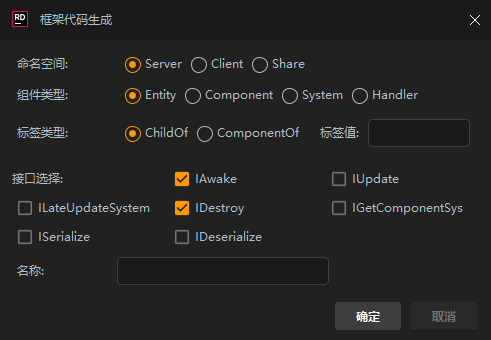
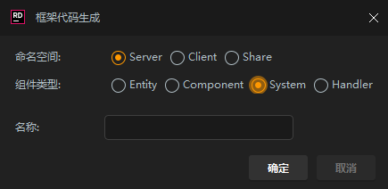
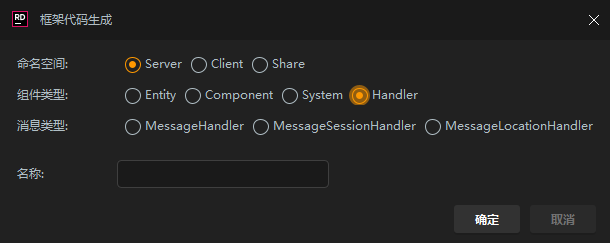

# 🚀 ET Framework 8.1 Code Generator

English | [简体中文](README.md)

## ✨ Features

🔸 Generate Entity, Component, System and Handler code  
🔸 Auto-implement common interfaces  
🔸 Support Server, Client and Share namespaces  
🔸 Support message handler code generation  
🔸 User-friendly GUI configuration

## 📥 Installation

> Just a few simple steps to complete installation

1️⃣ Download plugin file (.zip)  
2️⃣ Open IDE plugin settings (File -> Settings -> Plugins)  
3️⃣ Click gear icon, select "Install Plugin from Disk"  
4️⃣ Select downloaded plugin file to install  
5️⃣ Restart IDE to complete installation

## ⚠️ Notes

| Type | Description |
|------|-------------|
| Entity | No suffix added automatically |
| Component | "Component" suffix added automatically |
| System | "System" suffix added automatically |
| Handler | "Handler" suffix added automatically |

> 💡 Handler class names must follow X2Y_ZZZ format, otherwise generics need to be filled manually

## 🔨 Usage

Expand to view detailed steps

1. Right click on project folder
2. Select New -> ET Code
3. Configure options in the popup dialog
   

   

   

4. Click OK to generate code

## 🤝 Support

If you have any issues, please [create an Issue](../../issues) 📮

---
*Make code generation simpler, development more efficient!*