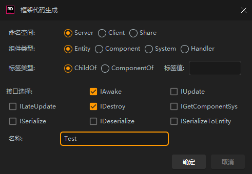
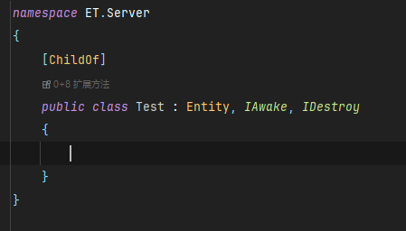
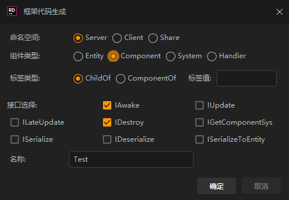
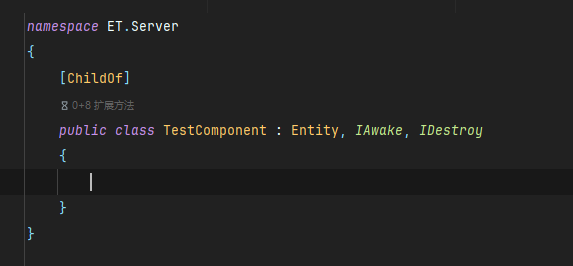
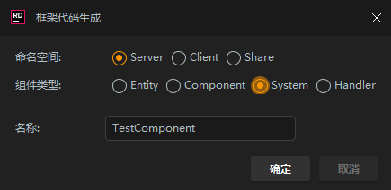
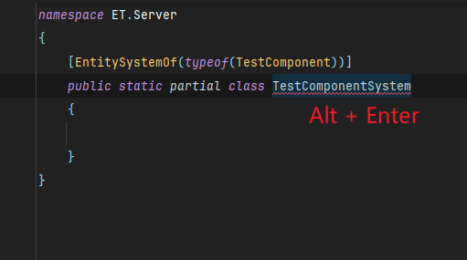
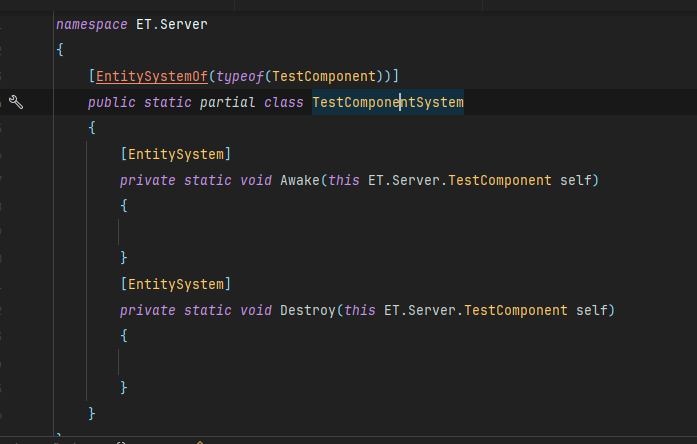
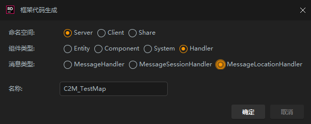
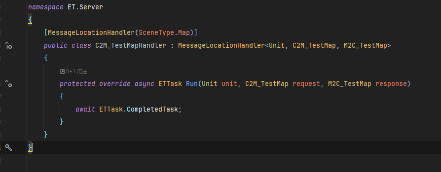

# 🚀 ET框架8.1代码生成工具

[English](README-EN.md) | 简体中文

## ✨ 功能特点

🔸 支持生成 Entity、Component、System 和 Handler 代码  
🔸 支持自动添加常用接口实现  
🔸 支持 Server、Client 和 Share 命名空间  
🔸 支持消息处理器代码生成  
🔸 提供友好的图形界面配置

## 📥 安装方法

> 只需简单几步即可完成安装

1️⃣ 下载插件文件 (.zip)  
2️⃣ 打开 IDE 的插件设置 (File -> Settings -> Plugins)  
3️⃣ 点击齿轮图标，选择 "Install Plugin from Disk"  
4️⃣ 选择下载的插件文件进行安装  
5️⃣ 重启 IDE 完成安装

## ⚠️ 注意事项

| 类型 | 说明 |
|------|------|
| Entity | 不会自动添加后缀 |
| Component | 自动添加 Component 后缀 |
| System | 自动添加 System 后缀 |
| Handler | 自动添加 Handler 后缀 |

> 💡 Handler 类命名需遵循 X2Y_ZZZ 格式，否则需要手动填写泛型

## 🔨 使用方法

展开查看详细步骤

1. 右键点击项目文件夹
2. 选择 New -> ET Code
3. 在弹出的对话框中配置相关选项
   <h3 align="center">创建实体</h3>
   

   

   
   <h3 align="center">创建组件</h3>
   

   

   
   <h3 align="center">创建系统</h3>
   

   

   

   
   <h3 align="center">创建消息处理类</h3>
   

   

4. 点击确定生成代码

## 🤝 支持

如有问题，请[提Issue](../../issues) 📮

## 📝 图标来源

<a href="https://www.flaticon.com/free-icons/c-sharp" title="c sharp icons">C sharp icons created by Freepik - Flaticon</a>

---
*让代码生成更简单，让开发更高效！*